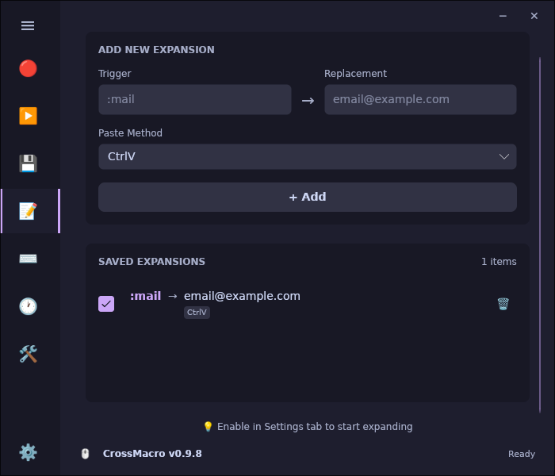

# CrossMacro

A modern mouse and keyboard macro recording and playback application for Linux (Wayland and X11) and Windows.

## Screenshots

| Recording | Playback | Files |
| :---: | :---: | :---: |
|  |  |  |
| **Text Expansion** | **Settings** | |
|  |  | |

## 🖥️ Supported Platforms

### Full Support (Absolute Positioning)
- **Linux**
  - Hyprland (Wayland) ✓
  - KDE Plasma (Wayland & X11) ✓
  - GNOME (Wayland & X11) ✓
  - X11 (All other desktop environments) ✓
- **Windows** ✓

### Partial Support (Relative Positioning)
- **Linux**
  - Other Wayland compositors (fallback mode)


## 🎯 Features

- **Mouse Event Recording**: Record mouse clicks and movements
- **Keyboard Event Recording**: Record keyboard key presses
- **Text Expansion**: Create text shortcuts for quick insertions (e.g. :mail -> email@example.com)
- **Playback**: Replay recorded macros with pause/resume support
- **Loop Mode**: Continuously repeat macros with customizable repeat count and delay
- **Speed Control**: Adjust playback speed from 0.1x to 10.0x
- **File Operations**: Save/load macros in .macro format (you choose where to save)
- **Global Hotkeys**: Customizable global hotkey support
  - **F8**: Start/Stop recording
  - **F9**: Start/Stop playback
  - **F10**: Pause/Resume playback
- **System Tray Icon**: Minimize to tray and control macros from system tray (optional)

## 📥 Installation

### Debian / Ubuntu (.deb)
```bash
# Download from GitHub Releases, then:
sudo apt install ./crossmacro-*_amd64.deb

# Add yourself to the crossmacro group (required for daemon communication)
sudo usermod -aG crossmacro $USER

# Reboot your system for group changes to take effect, then start the app
```

### Fedora / RHEL (.rpm)
```bash
# Download from GitHub Releases, then:
sudo dnf install ./crossmacro-*.x86_64.rpm

# Add yourself to the crossmacro group (required for daemon communication)
sudo usermod -aG crossmacro $USER

# Reboot your system for group changes to take effect, then start the app
```

### Arch Linux
Available on the [AUR](https://aur.archlinux.org/packages/crossmacro):
```bash
# Using yay
yay -S crossmacro

# Using paru
paru -S crossmacro

# After installation, add yourself to the group
sudo usermod -aG crossmacro $USER

# Reboot your system for group changes to take effect, then start the app
```

### NixOS
**Run directly:**
```bash
nix run github:alper-han/CrossMacro
```

**Add to your configuration:**

Add this to your `flake.nix` inputs:
```nix
inputs.crossmacro.url = "github:alper-han/CrossMacro";
```

Then in your NixOS configuration:
```nix
{ inputs, ... }: {
  imports = [ inputs.crossmacro.nixosModules.default ];
  
  programs.crossmacro.enable = true;
  
  # Add your user to the crossmacro group
  users.users.yourusername.extraGroups = [ "crossmacro" ];
}
```

> **Note:** The NixOS module automatically sets up the daemon service, user, and groups. Just add yourself to the `crossmacro` group.

### AppImage (Portable)

This method allows you to run the app without installing anything extra.
Since AppImages run on FUSE, we recommend configuring **User Group Permissions** for the best experience.

> **⚠️ Security Warning:** Adding your user to the `input` group grants your user account direct access to all input devices (keystrokes, mouse moves). This bypasses the secure daemon isolation typically recommended for Linux/Wayland, but is required for the AppImage to function without a system service.

**Setup Instructions (Required) 🛠️**
This allows you to run the app normally (just double-click) without needing sudo.

1. **One-time setup** (Run in terminal):
   ```bash
   # Add udev rule for uinput access
   echo 'KERNEL=="uinput", GROUP="input", MODE="0660", OPTIONS+="static_node=uinput"' | sudo tee /etc/udev/rules.d/99-crossmacro.rules
   
   # Reload rules
   sudo udevadm control --reload-rules && sudo udevadm trigger
   
   # Add your user to input group
   sudo usermod -aG input $USER
   ```
2. **Restart your computer** (Important for group changes to take effect).
3. **Run the App**:
   ```bash
   chmod +x CrossMacro-*.AppImage
   ./CrossMacro-*.AppImage
   ```

### Windows

Download the `.exe` file from [GitHub Releases](https://github.com/alper-han/CrossMacro/releases) and run it directly.

> **Note:** No installation required. The executable is self-contained and doesn't require .NET to be installed.

### Manual Build (Development)

**Requirements:** .NET 10 SDK

```bash
# Clone the repository
git clone https://github.com/alper-han/CrossMacro.git
cd CrossMacro

# Install daemon (Linux only)
sudo ./scripts/daemon/install.sh

# Run the application
dotnet run --project src/CrossMacro.UI/
```

## ⚙️ How It Works (Linux)

CrossMacro uses a **secure daemon architecture** on Linux:

```
┌─────────────────┐     IPC Socket      ┌──────────────────────┐
│  CrossMacro UI  │ ◄─────────────────► │  CrossMacro Daemon   │
│  (Your User)    │                     │  (System Service)    │
└─────────────────┘                     └──────────────────────┘
                                               │
                                               ▼
                                        /dev/input/* (read)
                                        /dev/uinput  (write)
```

- **Daemon** runs as a system service with `input` group privileges
- **UI** runs as your normal user, communicates via Unix socket
- **Security**: Your user never needs direct access to input devices

## 🛠️ Troubleshooting

<details>
<summary><strong>GNOME: Extension Required</strong></summary>

CrossMacro requires a GNOME Shell extension to **read mouse position** on Wayland. The extension is **automatically installed** when you first run CrossMacro.

> **Note:** When using AppImage (without the system daemon), this extension is still required for recording mouse positions. The app will handle input simulation directly via the permissions granted.

**You need an extension manager to enable it:**

| Distro | Command |
|--------|---------|
| Fedora | `sudo dnf install gnome-extensions-app` |
| Ubuntu/Debian | `sudo apt install gnome-shell-extension-manager` |
| Arch | `sudo pacman -S extension-manager` |

CrossMacro will show a warning if the extension is missing or disabled.

</details>

<details>
<summary><strong>Daemon Not Running</strong></summary>

Check daemon status:
```bash
systemctl status crossmacro.service
```

If not running:
```bash
sudo systemctl start crossmacro.service
sudo systemctl enable crossmacro.service  # Auto-start on boot
```

</details>

<details>
<summary><strong>Permission Denied Errors</strong></summary>

Ensure you're in the `crossmacro` group:
```bash
groups | grep crossmacro
```

If not, add yourself:
```bash
sudo usermod -aG crossmacro $USER
# Reboot your system for group changes to take effect!
```

</details>

<details>
<summary><strong>Polkit Not Available (Minimal/Embedded Systems)</strong></summary>

The daemon requires **polkit** for authorization. If your system doesn't have polkit installed (some minimal or embedded distributions), the daemon will reject all connections.

**Check if polkit is installed:**
```bash
which pkcheck
# or
pkcheck --version
```

**If polkit is not available:**
- The daemon won't work without polkit
- Use the **AppImage** instead with `input` group permissions (see AppImage section above)

> **Note:** Most desktop Linux distributions (Fedora, Ubuntu, Arch, etc.) include polkit by default. This is typically only an issue on minimal server installations or embedded systems.

</details>


## 📄 License

GPL-3.0 License - see [LICENSE](LICENSE) for details.

## 🤝 Contributing

Contributions are welcome! Please read [CONTRIBUTING.md](CONTRIBUTING.md) before submitting PRs.

