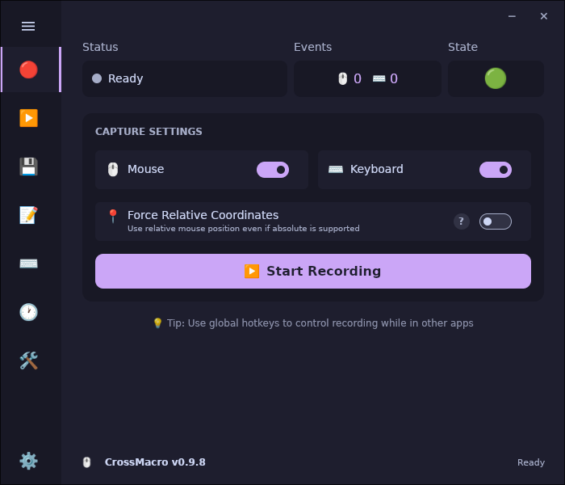
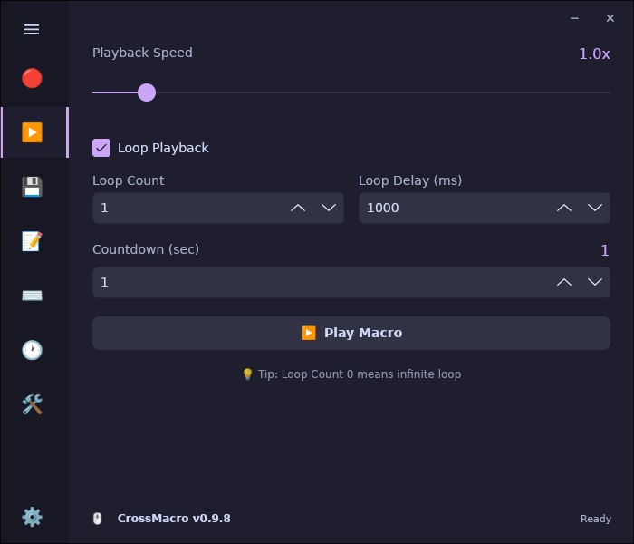
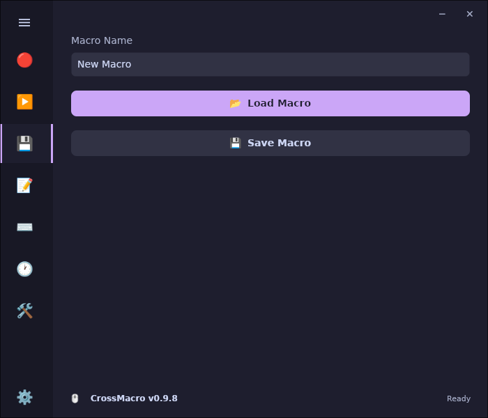
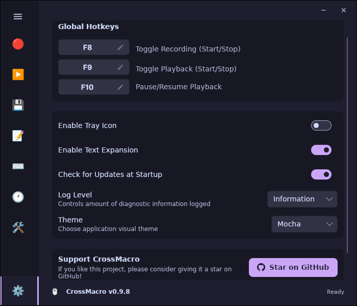

# CrossMacro

A modern mouse macro recording and playback application for Linux Wayland and X11.

## Screenshots

| Recording | Playback |
| :---: | :---: |
|  |  |
| **Files** | **Settings** |
|  |  |

## 🖥️ Supported Platforms

- **Linux** (Wayland & X11)
  - Hyprland ✓
  - KDE Plasma ✓
  - GNOME ✓
  - X11 ✓


## 🎯 Features

- **Mouse Event Recording**: Record mouse clicks and movements
- **Playback**: Replay recorded macros
- **Loop Mode**: Continuously repeat macros
- **Speed Control**: Adjust playback speed from 0.25x to 5.0x
- **File Operations**: Save/load macros in .macro format
- **Global Hotkeys**: Global hotkey support

## ⚙️ Setup & Configuration

<details>
<summary>⚠️ Required Permissions (Read First)</summary>

To record and play macros without `sudo`, you must configure permissions:

1. **Add user to input group:**
   ```bash
   sudo usermod -aG input $USER
   ```

2. **Configure uinput rules:**
   ```bash
   echo 'KERNEL=="uinput", GROUP="input", MODE="0660"' | sudo tee /etc/udev/rules.d/99-crossmacro.rules
   ```

3. **Apply changes:**
   ```bash
   sudo udevadm control --reload-rules && sudo udevadm trigger
   ```
   *Note: You may need to logout and login again for group changes to take effect.*

</details>

<details>
<summary>⚙️ Additional Setup for GNOME Users</summary>

CrossMacro automatically installs a GNOME Shell extension to capture mouse positions. To enable this extension, you need an extension manager application:

**Fedora:**
```bash
# Usually pre-installed. If missing:
sudo dnf install gnome-extensions-app
```

**Ubuntu/Debian:**
```bash
sudo apt install gnome-shell-extension-manager
```

**Arch Linux:**
```bash
sudo pacman -S extension-manager
```

After installing the extension manager, simply:
1. Run CrossMacro (the extension will be automatically installed and enabled)
2. Log out and log back in for changes to take effect

</details>

## 📥 Installation

<details>
<summary><strong>Debian / Ubuntu (.deb)</strong></summary>

```bash
# Example: crossmacro-0.1.0_amd64.deb
sudo dpkg -i crossmacro-*_amd64.deb
```
</details>

<details>
<summary><strong>Fedora / RHEL (.rpm)</strong></summary>

```bash
# Example: crossmacro-0.1.0-1.x86_64.rpm
sudo rpm -i crossmacro-*.x86_64.rpm
```
</details>

<details>
<summary><strong>Arch Linux</strong></summary>

Available on the [AUR](https://aur.archlinux.org/packages/crossmacro):

```bash
# Using yay
yay -S crossmacro

# Using paru
paru -S crossmacro
```
</details>

<details>
<summary><strong>NixOS</strong></summary>

```bash
nix run github:alper-han/CrossMacro
```
</details>

<details>
<summary><strong>AppImage</strong></summary>

```bash
# Example: CrossMacro-0.1.0-x86_64.AppImage
chmod +x CrossMacro-*.AppImage && ./CrossMacro-*.AppImage
```
</details>

<details>
<summary><strong>Manual Build</strong></summary>

```bash
dotnet run --project src/CrossMacro.UI/
```
</details>

## 🚧 In Progress
- [ ] Keyboard macro support

## 📅 Planned
- [ ] Virtual keyboard device creation
- [ ] Windows support
- [ ] Localization support
- [ ] Theme support
- [ ] Cross-platform support expansion


