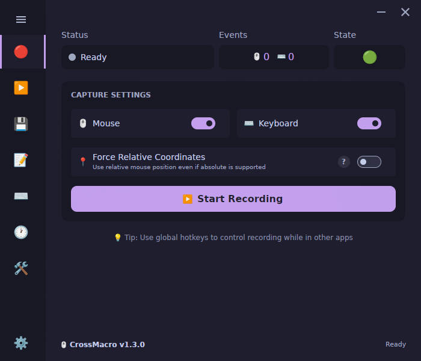
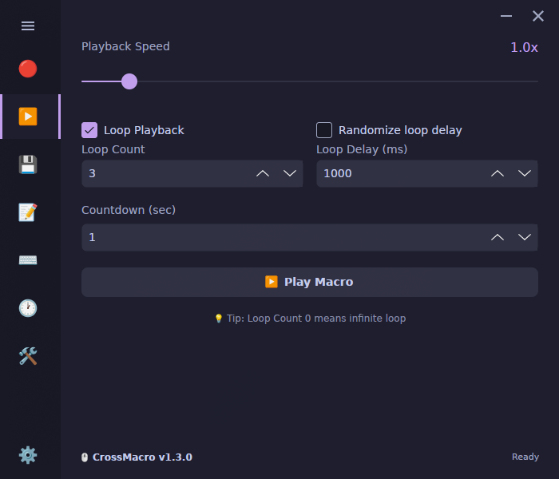
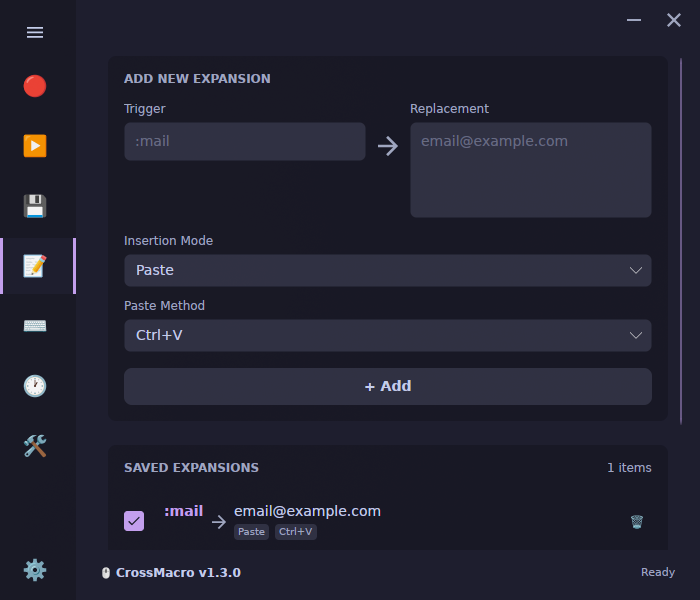
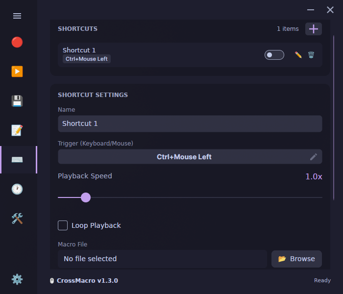
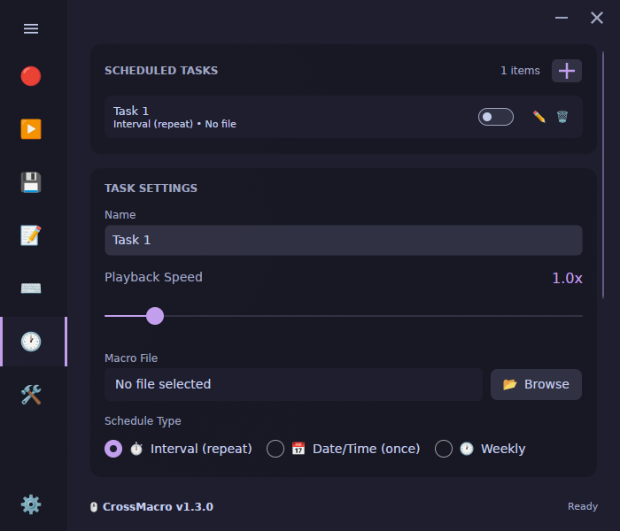
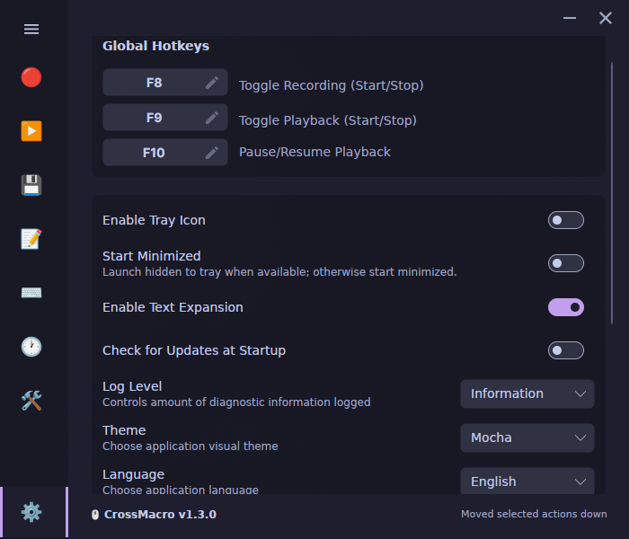

# CrossMacro


[](https://github.com/alper-han/CrossMacro/actions/workflows/pr-check.yml)
[](https://github.com/alper-han/CrossMacro/releases)
[](LICENSE)

<p align="center">
  
</p>

CrossMacro is a cross-platform mouse and keyboard macro recorder and player with macro editor, text expansion, shortcuts, and scheduling.

- Linux support for Wayland and X11
- Windows support (Microsoft Store, winget, portable binary)
- macOS support

## Contents

- [Features](#features)
- [Screenshots](#screenshots)
- [Quick Start](#quick-start)
- [Installation](#installation)
- [CLI Usage](#cli-usage)
- [Troubleshooting](#troubleshooting)
- [Contributing](#contributing)
- [Security](#security)
- [Contributors](#contributors)
- [Star History](#star-history)
- [License](#license)

## Features

- Mouse event recording (clicks and movement)
- Keyboard event recording
- Macro playback with pause/resume
- Loop mode, repeat count, and repeat delay controls
- Playback speed control (`0.1x` to `10.0x`)
- Macro editor with undo/redo, coordinate capture, and action reordering
- Text expansion shortcuts (for example `:mail` -> `email@example.com`)
- Shortcut-bound macro execution (keyboard key, mouse button, or key combo)
- Shortcut modes: toggle and run-while-held
- Shortcut loop controls: repeat count and repeat delay
- Scheduled task execution
- Save and load `.macro` files
- Optional system tray controls
- Theme support (Classic, Latte, Mocha, Dracula, Nord)
- Customizable global hotkeys:
  - `F8` start/stop recording
  - `F9` start/stop playback
  - `F10` pause/resume playback
- CLI and headless workflows

## Screenshots

| Recording | Playback | Text Expansion |
| :---: | :---: | :---: |
|  |  |  |
| **Shortcuts** | **Scheduled Tasks** | **Settings** |
|  |  |  |

## Quick Start

1. Install CrossMacro.
2. Launch the app.
3. Press `F8` to start/stop recording.
4. Press `F9` to start/stop playback.
5. Press `F10` to pause/resume playback.
6. Save your macro and optionally bind it to a shortcut.

## Installation

Download page for all release binaries:

- [GitHub Releases](https://github.com/alper-han/CrossMacro/releases)

### Quick Install Matrix

| Platform | Channel | Command / Link | Notes |
| --- | --- | --- | --- |
|  | `.deb` | `sudo apt install ./crossmacro-*_amd64.deb` | Download package from Releases first |
|  | `.rpm` | `sudo dnf install ./crossmacro-*.x86_64.rpm` | Download package from Releases first |
|  | AUR | `yay -S crossmacro` or `paru -S crossmacro` | Community package |
|  | AppImage | From [Releases](https://github.com/alper-han/CrossMacro/releases) | Quick one-time setup (see AppImage Setup) |
|  | nixpkgs | `nix profile install nixpkgs#crossmacro` | Updated on nixos-unstable channel cadence |
|  | flake | `nix run github:alper-han/CrossMacro` | Runs directly from repo |
|  | Store | <https://apps.microsoft.com/detail/9n1qp1d6js70> | Managed updates |
|  | winget | `winget install -e --id AlperHan.CrossMacro` | CLI install path |
|  | Portable EXE | From [Releases](https://github.com/alper-han/CrossMacro/releases) | Self-contained binary |
|  | `.dmg` | From [Releases](https://github.com/alper-han/CrossMacro/releases) | Drag to Applications |

> **AppImage users:** Run the quick one-time setup in [AppImage Setup](#appimage-setup-portable-linux) before first launch.

### Linux Post-Install (Daemon Packages)

After installing Linux packages (`.deb`, `.rpm`, AUR), run:

```bash
sudo usermod -aG crossmacro $USER
sudo systemctl enable --now crossmacro.service
# Reboot or re-login for group changes
```

### AppImage Setup (Portable Linux)

If you use the AppImage build on Linux, complete this one-time setup before first launch:

```bash
# Add uinput rule
echo 'KERNEL=="uinput", GROUP="input", MODE="0660", OPTIONS+="static_node=uinput"' | sudo tee /etc/udev/rules.d/99-crossmacro.rules

# Reload udev rules
sudo udevadm control --reload-rules && sudo udevadm trigger

# Add your user to input group
sudo usermod -aG input $USER
```

Then reboot/re-login and run:

```bash
chmod +x CrossMacro-*.AppImage
./CrossMacro-*.AppImage
```

Note: adding a user to `input` grants direct access to input devices.

### Advanced Platform Notes

<details>
<summary><strong>Nixpkgs (unstable)</strong></summary>

```bash
nix profile install nixpkgs#crossmacro
```

</details>

<details>
<summary><strong>Run directly from this repo flake</strong></summary>

```bash
nix run github:alper-han/CrossMacro
```

</details>

<details>
<summary><strong>Use as flake input in your own flake.nix</strong></summary>

```nix
{
  inputs.crossmacro.url = "github:alper-han/CrossMacro";

  outputs = { self, crossmacro, ... }:
  let
    system = "x86_64-linux";
  in {
    packages.${system}.crossmacro = crossmacro.packages.${system}.default;
  };
}
```

</details>

<details>
<summary><strong>NixOS module</strong></summary>

```nix
{
  inputs.crossmacro.url = "github:alper-han/CrossMacro";

  outputs = { nixpkgs, crossmacro, ... }: {
    nixosConfigurations.myhost = nixpkgs.lib.nixosSystem {
      system = "x86_64-linux";
      modules = [
        crossmacro.nixosModules.default
        ({ ... }: {
          programs.crossmacro = {
            enable = true;
            users = [ "yourusername" ];
          };
        })
      ];
    };
  };
}
```

</details>

<details>
<summary><strong>Windows notes</strong></summary>

Update an existing winget install:

```powershell
winget upgrade -e --id AlperHan.CrossMacro
```

For Store and fresh-install options, use the Quick Install Matrix above.

</details>

<details>
<summary><strong>macOS notes</strong></summary>

1. Download `.dmg` from [Releases](https://github.com/alper-han/CrossMacro/releases).
2. Drag **CrossMacro** to **Applications**.
3. Launch and grant Accessibility permissions when prompted.

If Gatekeeper blocks first launch:

```bash
xattr -cr /Applications/CrossMacro.app
```

</details>

## CLI Usage

```bash
crossmacro --help
crossmacro --version

crossmacro play ./demo.macro --speed 1.25 --repeat 3
crossmacro macro validate ./demo.macro
crossmacro macro info ./demo.macro
crossmacro doctor --json

crossmacro settings get
crossmacro settings get playback.speed
crossmacro settings set playback.speed 1.25

crossmacro schedule list
crossmacro schedule run <task-guid>
crossmacro shortcut list
crossmacro shortcut run <shortcut-guid>

crossmacro record --output ./recorded.macro --duration 10
crossmacro run --step "move abs 800 400" --step "click left" --dry-run
crossmacro headless
```

## Troubleshooting

<details>
<summary><strong>Daemon not running (Linux)</strong></summary>

```bash
systemctl status crossmacro.service
sudo systemctl start crossmacro.service
sudo systemctl enable crossmacro.service
```

</details>

<details>
<summary><strong>Linux input permissions</strong></summary>

```bash
groups | grep crossmacro
sudo usermod -aG crossmacro $USER
```

Reboot or re-login after group changes.

</details>

<details>
<summary><strong>GNOME Wayland extension</strong></summary>

GNOME Wayland needs a shell extension for absolute mouse position.
Log out/in after first-time setup if prompted.

</details>

<details>
<summary><strong>Wayland cursor positioning options</strong></summary>

CrossMacro works on Wayland.

- Absolute cursor position is available on:
  - Hyprland (IPC)
  - KDE Plasma (D-Bus)
  - GNOME (Shell Extension)
- On other compositors, CrossMacro automatically uses relative-position mode.
- You can force relative mode with **Force Relative Coordinates**.
- You can disable origin move at recording start with **Skip Initial 0,0 Position**.

Both absolute and relative modes support macro recording and playback.

</details>

<details>
<summary><strong>Enable debug logging</strong></summary>

```bash
sudo systemctl kill -s USR1 crossmacro.service
journalctl -u crossmacro.service -f
```

Send `USR1` again to restore normal log level.

</details>

<details>
<summary><strong>Polkit on minimal systems</strong></summary>

```bash
which pkcheck
pkcheck --version
```

Install polkit to enable daemon mode on minimal systems.

</details>

<details>
<summary><strong>Input capture conflicts (Linux)</strong></summary>

Some applications can lock input devices exclusively.
If capture/playback behaves inconsistently, pause conflicting tools (example: GPU Screen Recorder), test CrossMacro, then resume them.

</details>

## Contributing

- Contribution guide: [CONTRIBUTING.md](CONTRIBUTING.md)
- Issues (bugs/features): <https://github.com/alper-han/CrossMacro/issues>
- Discussions (questions/ideas): <https://github.com/alper-han/CrossMacro/discussions>

## Security

- Security policy: [SECURITY.md](SECURITY.md)
- Private vulnerability reporting: <https://github.com/alper-han/CrossMacro/security/advisories/new>

## Contributors

Thanks to everyone who contributes to CrossMacro.

[](https://github.com/alper-han/CrossMacro/graphs/contributors)

## Star History

[](https://starchart.cc/alper-han/CrossMacro)

## License

Licensed under GPL-3.0. See [LICENSE](LICENSE).
