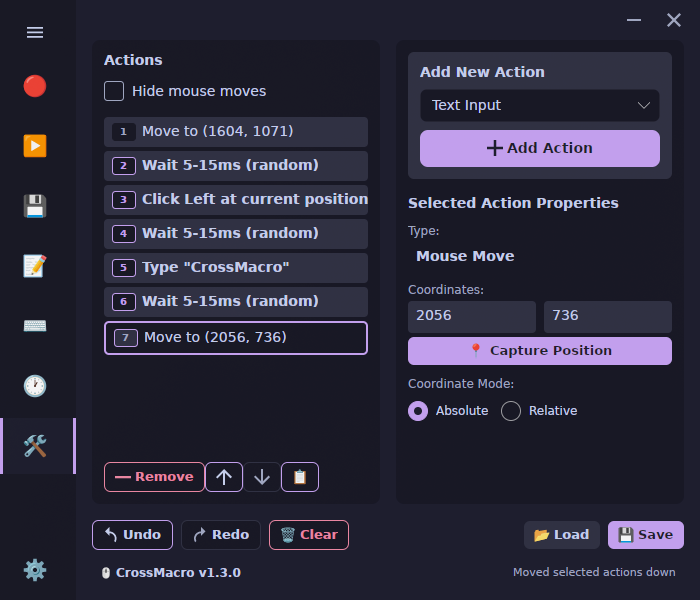

# CrossMacro


[](https://flathub.org/en/apps/io.github.alper_han.crossmacro)
[](https://github.com/alper-han/CrossMacro/releases)
[](https://discord.gg/QUBuND5TvM)
[](https://github.com/alper-han/CrossMacro/actions/workflows/pr-check.yml)

<p align="center">
  
</p>

CrossMacro is a cross-platform mouse and keyboard macro recorder and player with macro editor, text expansion, shortcuts, and scheduling.

- Linux support for Wayland and X11
- Windows support (Microsoft Store, winget, portable binary)
- macOS support

## Contents

- [Features](#features)
- [Screenshots](#screenshots)
- [Quick Start](#quick-start)
- [Installation](#installation)
- [CLI Usage](#cli-usage)
- [Troubleshooting](#troubleshooting)
- [Contributing](#contributing)
- [Security](#security)
- [Contributors](#contributors)
- [Star History](#star-history)
- [License](#license)
- [Community](#community)

## Features

- Mouse event recording (clicks and movement)
- Keyboard event recording
- Macro playback with pause/resume
- Loop mode, repeat count, and repeat delay controls
- Playback speed control (`0.1x` to `10.0x`)
- Macro editor with undo/redo, coordinate capture, and action reordering
- Text expansion shortcuts (for example `:mail` -> `email@example.com`)
- Shortcut-bound macro execution (keyboard key, mouse button, or key combo)
- Shortcut modes: toggle and run-while-held
- Shortcut loop controls: repeat count and repeat delay
- Scheduled task execution
- Save and load `.macro` files
- Optional system tray controls
- Theme support (Classic, Latte, Mocha, Dracula, Nord, Everforest, Gruvbox, Solarized, Crimson)
- Customizable global hotkeys:
  - `F8` start/stop recording
  - `F9` start/stop playback
  - `F10` pause/resume playback
- CLI and headless workflows

## Screenshots

| Playback | Text Expansion | Shortcuts |
| :---: | :---: | :---: |
|  |  |  |
| **Scheduled Tasks** | **Editor** | **Settings** |
|  |  |  |

## Quick Start

1. Install CrossMacro.
2. Launch the app.
3. Press `F8` to start/stop recording.
4. Press `F9` to start/stop playback.
5. Press `F10` to pause/resume playback.
6. Save your macro and optionally bind it to a shortcut.

## Installation

Download page for all release binaries:

- [GitHub Releases](https://github.com/alper-han/CrossMacro/releases)

### Quick Install Matrix

| Platform | Channel | Command / Link | Notes |
| --- | --- | --- | --- |
| [](https://flathub.org/en/apps/io.github.alper_han.crossmacro) | Flathub | [Store](https://flathub.org/en/apps/io.github.alper_han.crossmacro)<br>`flatpak install flathub io.github.alper_han.crossmacro` | Sandboxed install |
| [](https://github.com/alper-han/CrossMacro/releases) | `.deb` | `sudo apt install ./crossmacro*.deb` | Download from Releases |
| [](https://github.com/alper-han/CrossMacro/releases) | `.rpm` | `sudo dnf install ./crossmacro*.rpm` | Download from Releases |
| [](https://aur.archlinux.org/packages/crossmacro) | AUR | `yay -S crossmacro`<br>`paru -S crossmacro` | Community package |
| [](https://github.com/alper-han/CrossMacro/releases) | AppImage | [Releases](https://github.com/alper-han/CrossMacro/releases) | One-time setup required |
| [](https://search.nixos.org/packages?channel=unstable&query=crossmacro) | nixpkgs | `nix profile install nixpkgs#crossmacro` | Unstable channel |
|  | flake | `nix run github:alper-han/CrossMacro` | Run from repo |
| [](https://apps.microsoft.com/detail/9n1qp1d6js70) | Store | [Store](https://apps.microsoft.com/detail/9n1qp1d6js70) | Managed updates |
|  | winget | `winget install AlperHan.CrossMacro` | CLI install |
| [](https://github.com/alper-han/CrossMacro/releases) | Portable EXE | [Releases](https://github.com/alper-han/CrossMacro/releases) | Self-contained |
| [](https://github.com/alper-han/CrossMacro/releases) | `.dmg` | [Releases](https://github.com/alper-han/CrossMacro/releases) | Drag to Apps |

> **AppImage users:** Run the quick one-time setup in [AppImage Setup](#appimage-setup-portable-linux) before first launch.
> **Flatpak users (Wayland):** On first launch, CrossMacro may show a **Wayland Setup Required** dialog and run Quick Setup for device permissions.

### Linux Post-Install (Daemon Packages)

After installing daemon packages on Linux, run:

```bash
sudo usermod -aG crossmacro $USER
# Reboot or re-login for group changes
```

`AUR`, `.deb`, and `.rpm` packages try to enable/start `crossmacro.service` during install
on `systemd` hosts. If your environment skips that step (for example non-systemd/chroot),
run manually:

```bash
sudo systemctl enable --now crossmacro.service
```

Note: `crossmacro` group membership allows the client to talk to the daemon socket.
The daemon service user needs device access for `/dev/input/event*` and `/dev/uinput`
(typically via `input` and, on some distros, `uinput` groups).

### AppImage Setup (Portable Linux)

If you use the AppImage build on Linux, complete this one-time setup before first launch:

```bash
# Add uinput rule
echo 'KERNEL=="uinput", GROUP="input", MODE="0660", OPTIONS+="static_node=uinput"' | sudo tee /etc/udev/rules.d/99-crossmacro.rules

# Reload udev rules
sudo udevadm control --reload-rules && sudo udevadm trigger

# Add your user to input group
sudo usermod -aG input $USER
```

Then reboot/re-login and run:

```bash
chmod +x CrossMacro-*.AppImage
./CrossMacro-*.AppImage
```

Note: adding a user to `input` grants direct access to input devices.

### Flatpak Wayland Setup

For Flatpak on Wayland, CrossMacro supports two modes:

- Daemon mode (socket at `/run/crossmacro/crossmacro.sock`)
- Direct mode (device access in sandbox)

If required permissions are missing, app startup shows **Wayland Setup Required** and can run Quick Setup automatically.
Quick Setup uses `flatpak-spawn --host pkexec` and applies session ACLs on host:

- `rw` access to `/dev/uinput` (or `/dev/input/uinput` if present)
- `r` access to `/dev/input/event*`

If Quick Setup is denied or fails, you can apply the same permissions manually on host:

```bash
sudo modprobe uinput
for p in /dev/uinput /dev/input/uinput; do [ -e "$p" ] && sudo setfacl -m "u:$USER:rw" "$p"; done
for p in /dev/input/event*; do [ -e "$p" ] && sudo setfacl -m "u:$USER:r" "$p"; done
```

If `setfacl` is missing, install your distro's `acl` package first.

### Advanced Platform Notes

<details>
<summary><strong>Nixpkgs (unstable)</strong></summary>

```bash
nix profile install nixpkgs#crossmacro
```

</details>

<details>
<summary><strong>Run directly from this repo flake</strong></summary>

```bash
nix run github:alper-han/CrossMacro
```

</details>

<details>
<summary><strong>Use as flake input in your own flake.nix</strong></summary>

```nix
{
  inputs.crossmacro.url = "github:alper-han/CrossMacro";

  outputs = { self, crossmacro, ... }:
  let
    system = "x86_64-linux";
  in {
    packages.${system}.crossmacro = crossmacro.packages.${system}.default;
  };
}
```

</details>

<details>
<summary><strong>NixOS module</strong></summary>

```nix
{
  inputs.crossmacro.url = "github:alper-han/CrossMacro";

  outputs = { nixpkgs, crossmacro, ... }: {
    nixosConfigurations.myhost = nixpkgs.lib.nixosSystem {
      system = "x86_64-linux";
      modules = [
        crossmacro.nixosModules.default
        ({ ... }: {
          programs.crossmacro = {
            enable = true;
            users = [ "yourusername" ];
          };
        })
      ];
    };
  };
}
```

</details>

<details>
<summary><strong>Windows notes</strong></summary>

Update an existing winget install:

```powershell
winget upgrade -e --id AlperHan.CrossMacro
```

For Store and fresh-install options, use the Quick Install Matrix above.

</details>

<details>
<summary><strong>macOS notes</strong></summary>

1. Download `.dmg` from [Releases](https://github.com/alper-han/CrossMacro/releases).
2. Drag **CrossMacro** to **Applications**.
3. Launch and grant Accessibility permissions when prompted.

If Gatekeeper blocks first launch:

```bash
xattr -cr /Applications/CrossMacro.app
```

</details>

## CLI Usage

```bash
crossmacro --help
crossmacro --version

crossmacro play ./demo.macro --speed 1.25 --repeat 3
crossmacro macro validate ./demo.macro
crossmacro macro info ./demo.macro
crossmacro doctor --json

crossmacro settings get
crossmacro settings get playback.speed
crossmacro settings set playback.speed 1.25

crossmacro schedule list
crossmacro schedule run <task-guid>
crossmacro shortcut list
crossmacro shortcut run <shortcut-guid>

crossmacro record --output ./recorded.macro --duration 10
crossmacro headless
```

### Run Command Reference

<details>
<summary><strong>Run Syntax and Options</strong></summary>

Syntax:

```bash
crossmacro run --step <step> [--step <step> ...] [--file <steps-file>] [--speed <value>] [--countdown <sec>] [--timeout <sec>] [--dry-run] [--json] [--log-level <level>]
crossmacro run <step-command> [<step-command> ...] [--file <steps-file>] [--speed <value>] [--countdown <sec>] [--timeout <sec>] [--dry-run] [--json] [--log-level <level>]
```

Options:

- `--step`: Add one run step (repeatable).
- `--file`: Load steps from file (one step per line, `#` comments allowed).
- `--speed`: Playback speed multiplier (`0.1`..`10.0`).
- `--countdown`: Countdown before execution in seconds (`>= 0`).
- `--timeout`: Command timeout in seconds (`>= 0`).
- `--dry-run`: Parse/compile/validate only, do not send input.
- `--json`: Print machine-readable JSON result.
- `--log-level`: Override log level (`Debug|Information|Warning|Error`).

</details>

<details>
<summary><strong>Run Step Commands and Examples</strong></summary>

Step commands:

- `move abs <x> <y>`, `move rel <dx> <dy>`
- `click <button>`, `down <button>`, `up <button>`
- `click current <button>`, `down current <button>`, `up current <button>`
- `scroll <up|down|left|right> [count]`
- `key down <key>`, `key up <key>`, `tap <combo>`, `type <text>`
- `delay <ms>`, `delay random <min> <max>`, `delay random <min>..<max>`
- `set <name> <value>` or `set <name>=<value>`
- `inc <name> [amount]`, `dec <name> [amount]`
- `repeat <count> { ... }`
- `if <left> <op> <right> { ... } else { ... }`
- `while <left> <op> <right> { ... }`
- `for <var> from <start> to <end> [step <n>] { ... }`
- `break`, `continue`, `}`

Examples:

```bash
crossmacro run --step "move abs 800 400" --step "click left" --dry-run
crossmacro run --step "set n=3" --step "repeat $n {" --step "click left" --step "delay random 20 50" --step "}"
crossmacro run --step "set i=0" --step "while $i < 10 {" --step "click left" --step "inc i" --step "}"
crossmacro run --step "for i from 0 to 10 {" --step "if $i == 3 {" --step "continue" --step "}" --step "if $i == 8 {" --step "break" --step "}" --step "click left" --step "}"
crossmacro run --step "move abs 800 400" --step "click current left"
crossmacro run --file ./steps.txt --json
```

</details>

## Troubleshooting

<details>
<summary><strong>Daemon not running (Linux)</strong></summary>

```bash
systemctl status crossmacro.service
sudo systemctl start crossmacro.service
sudo systemctl enable crossmacro.service
```

</details>

<details>
<summary><strong>Linux input permissions</strong></summary>

```bash
groups | grep crossmacro
sudo usermod -aG crossmacro $USER

stat -c '%A %a %U:%G %n' /dev/uinput
id crossmacro
sudo -u crossmacro test -w /dev/uinput && echo writable || echo not-writable
```

Reboot or re-login after group changes.

If daemon cannot write `/dev/uinput`, add service user to required groups and restart:

```bash
sudo usermod -aG input crossmacro
sudo usermod -aG uinput crossmacro
sudo systemctl restart crossmacro.service
```

</details>

<details>
<summary><strong>GNOME Wayland extension</strong></summary>

GNOME Wayland needs a shell extension for absolute mouse position.
Log out/in after first-time setup if prompted.

</details>

<details>
<summary><strong>Wayland cursor positioning options</strong></summary>

CrossMacro works on Wayland.

- Absolute cursor position is available on:
  - Hyprland (IPC)
  - KDE Plasma (D-Bus)
  - GNOME (Shell Extension)
- If an absolute cursor provider is unavailable, CrossMacro automatically falls back to relative-position mode.
- You can force relative mode with **Force Relative Coordinates**.
- You can disable origin move at recording start with **Skip Initial 0,0 Position**.

Both absolute and relative modes support macro recording and playback.

</details>

<details>
<summary><strong>Enable debug logging</strong></summary>

```bash
sudo systemctl kill -s USR1 crossmacro.service
journalctl -u crossmacro.service -f
```

Send `USR1` again to restore normal log level.

</details>

<details>
<summary><strong>Polkit on minimal systems</strong></summary>

```bash
which pkcheck
pkcheck --version
```

Install polkit to enable daemon mode on minimal systems.

</details>

<details>
<summary><strong>Input capture conflicts (Linux)</strong></summary>

Some applications can lock input devices exclusively.
If capture/playback behaves inconsistently, pause conflicting tools (example: GPU Screen Recorder), test CrossMacro, then resume them.

</details>

## Contributing

- Contribution guide: [CONTRIBUTING.md](CONTRIBUTING.md)
- Issues (bugs/features): <https://github.com/alper-han/CrossMacro/issues>
- Discussions (questions/ideas): <https://github.com/alper-han/CrossMacro/discussions>

## Security

- Security policy: [SECURITY.md](SECURITY.md)
- Private vulnerability reporting: <https://github.com/alper-han/CrossMacro/security/advisories/new>

## Contributors

Thanks to everyone who contributes to CrossMacro.

[](https://github.com/alper-han/CrossMacro/graphs/contributors)

## Star History

[](https://starchart.cc/alper-han/CrossMacro)

## License

Licensed under GPL-3.0-only. See [LICENSE](LICENSE).

## Community

<div><a href="https://discord.gg/QUBuND5TvM"></a></div>
