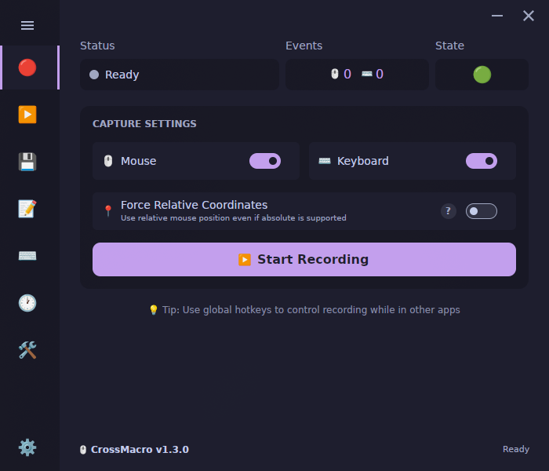
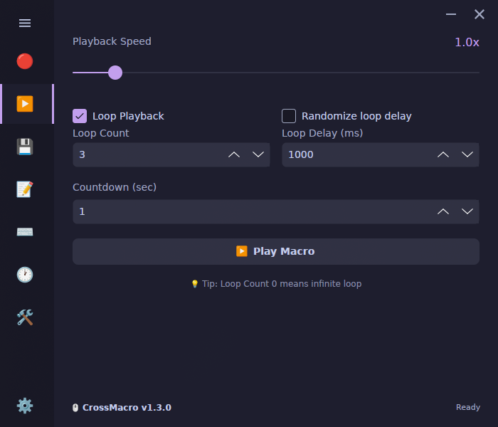
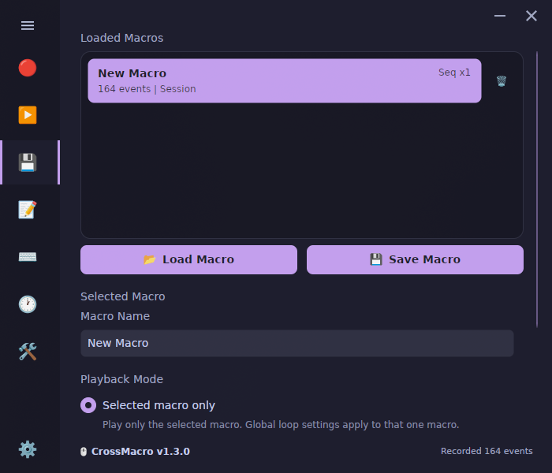
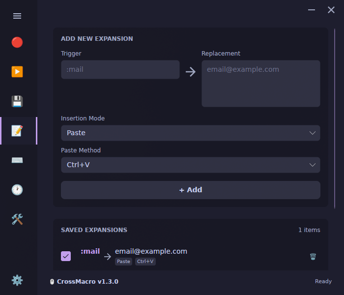
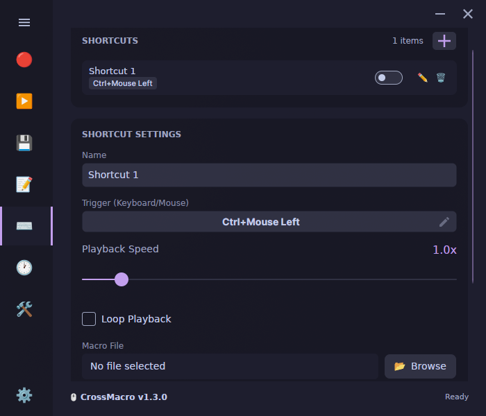
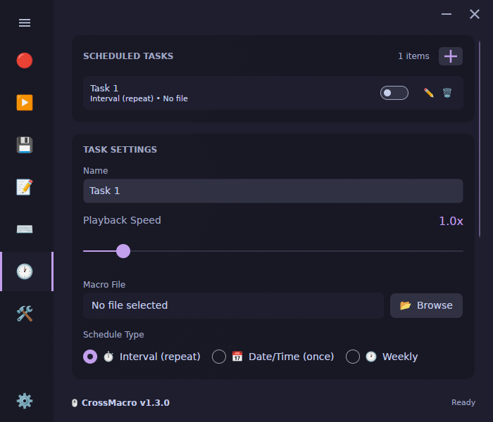
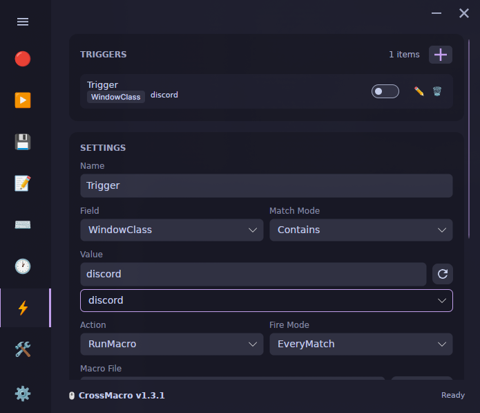
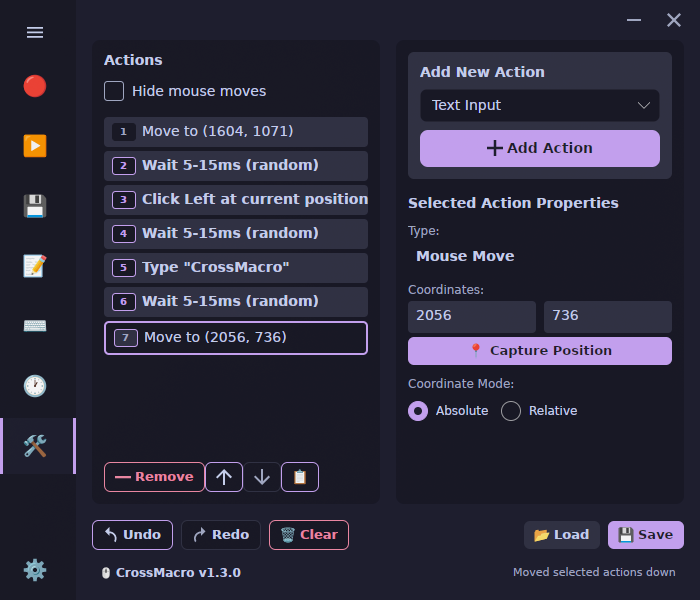
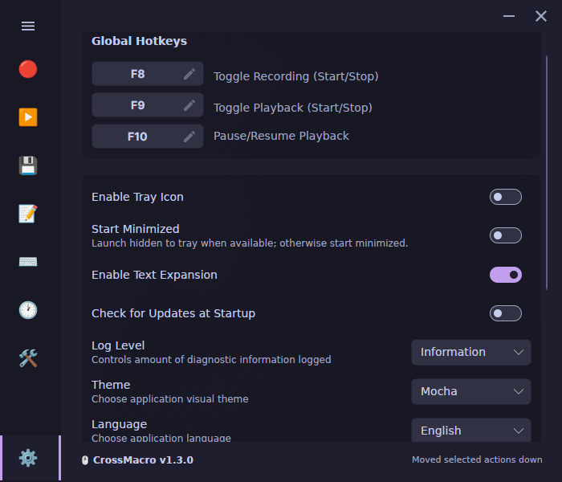

<h1 align="center">CrossMacro</h1>

<p align="center">
  <strong>Record once. Refine visually. Automate across supported desktop environments.</strong>
</p>

<p align="center">
  CrossMacro is a free, open-source mouse and keyboard automation app for Linux, Windows, and macOS.
</p>

<p align="center">
  <a href="https://flathub.org/apps/io.github.alper_han.crossmacro"></a>
  <a href="https://github.com/alper-han/CrossMacro/releases"></a>
  <a href="https://github.com/alper-han/CrossMacro/stargazers"></a>
  <a href="https://github.com/alper-han/CrossMacro/releases/latest"></a>
  <a href="https://github.com/alper-han/CrossMacro/actions/workflows/ci.yml"></a>
  <a href="LICENSE"></a>
</p>

<p align="center">
  <a href="https://flathub.org/apps/io.github.alper_han.crossmacro"></a>
  <a href="https://apps.microsoft.com/detail/9n1qp1d6js70"></a>
</p>

<p align="center">
  <a href="#install">Install</a> ·
  <a href="#your-first-macro">First macro</a> ·
  <a href="#features">Features</a> ·
  <a href="#why-crossmacro">Why CrossMacro</a> ·
  <a href="docs/cli.md">CLI</a> ·
  <a href="docs/mcp.md">MCP</a> ·
  <a href="docs/linux.md">Linux guide</a> ·
  <a href="https://discord.gg/QUBuND5TvM">Discord</a>
</p>

<p align="center">
  
</p>

<p align="center">
  <strong>Turn repetitive desktop work into reusable workflows.</strong><br>
  Record mouse and keyboard actions, refine them visually, then replay them from
  the GUI, a hotkey, a schedule, a trigger, the CLI, or a trusted local MCP host.
</p>

<p align="center">
  One open-source automation toolchain for Linux, Windows, and macOS, including
  Wayland and X11 support, screen-aware workflows, text expansion, profiles,
  background tasks, structured CLI output, and a policy-capable local MCP server.
</p>

## Why CrossMacro?

CrossMacro is for people who want desktop automation without stitching together
separate recorders, input tools, image matchers, hotkey managers, schedulers, text
expanders, and platform-specific scripts.

Start visually: record a real workflow and refine it in the editor. When the job
grows, the same automation engine gives you screen-aware actions, variables,
loops, conditions, window and clipboard control, background tasks, a structured
CLI, and a policy-controlled local MCP server with an optional restricted mode.

- **One workflow across platforms:** use a polished GUI and packaged builds on
  Linux, Windows, and macOS instead of maintaining separate automations for each
  operating system.
- **Modern Linux support:** Wayland and X11 are first-class targets, with native,
  daemon-backed, direct-device, portal screen-capture, and compositor-provider
  paths where the desktop exposes them.
- **GUI when you want it, CLI when you need it:** record and edit visually, run
  direct commands or scripts, consume JSON results, or keep automation active in
  the GUI-less desktop runtime.
- **More than playback:** wait for colors, images, or windows inside a workflow;
  react to process or workspace changes with triggers that run macros or switch
  profiles.
- **Everything stays connected:** files, editor actions, shortcuts, schedules,
  triggers, text expansion, CLI commands, and MCP tools share the same persisted
  profiles, settings, macro format, task data, and automation model.

## What People Build With It

| Use case | What CrossMacro adds |
| --- | --- |
| **Office and data entry** | Form filling, clipboard transforms, reusable text, and repeatable input sequences |
| **UI testing** | Recorded actions, controlled timing, screen-state checks, screenshots, and repeatable regression flows |
| **Screen-aware automation** | Wait for colors, images, or windows; react to process and workspace changes through triggers |
| **Scheduled desktop work** | Reports, downloads, backups, kiosk routines, and unattended sequences in an active session |
| **Creative and accessibility workflows** | Precise input timing, reusable profiles, shortcuts, and text expansion |
| **Permitted game workflows** | Reusable input profiles where the target application's rules and anti-cheat policy allow automation |
| **AI-assisted local workflows** | Trusted agents can use MCP without CrossMacro opening a network listener |

## Features

### Macro recorder and player

- Record mouse movement, clicks, button presses/releases, vertical and horizontal
  scrolling, and raw keyboard events; capture mouse and keyboard independently
  when a workflow needs only one input source.
- Replay from `0.1x` to `10.0x` with pause/resume, countdown, repeat counts,
  fixed or randomized repeat delays, and cancellation.
- Choose automatic, absolute, raw-relative, or logical-relative coordinates when
  supported by the active desktop session.
- Use precision motion or strict-speed playback with configurable report rates
  and motion-error limits.
- Customize the default global controls: `F8` record, `F9` play, and `F10`
  pause/resume.

### Macro editor and workflow building

- Load, save, rename, select, and replay reusable `.macro` files with Selected
  Only, Advance Selection, and Sequential Cycle modes, per-macro repeat counts,
  and fixed or randomized cycle delays.
- Edit mouse, keyboard, text, delay, clipboard, shell, screenshot, window,
  pixel/color, image, variable, loop, and condition actions visually.
- Hide noisy mouse moves and short waits, simplify movement, multi-select actions,
  and reorder, duplicate, or delete them with undo/redo, validation, coordinate
  capture, and image asset import.
- Build logic with variables, integer arithmetic, `repeat`, `for`, `while`, `if`,
  `else`, `break`, and `continue`.
- Read pixels, wait for colors, search or wait for PNG images, click matches, and
  capture full-screen or regional screenshots.
- Validate and test-run an edited workflow directly, then stop it from the editor
  without saving an intermediate file.

### Hotkeys, schedules, triggers, and background automation

- Bind macros to global keyboard or mouse shortcuts with toggle, repeat,
  run-while-held, per-task playback speed, randomized delay, and focused-window
  class/title/process rules using equals, contains, or regex matching.
- Schedule one-time, fixed/random interval, daily, weekday, weekend, or weekly
  execution with per-task playback speed plus last-run, next-run, and status
  tracking.
- React to window class, title, process, or workspace changes; run a macro or
  switch profiles with debounce, cooldown, and enter/exit fire modes.
- Keep global hotkeys, schedules, shortcuts, text expansion, and record/play
  controls active in the GUI-less desktop runtime.
- Record, inspect, validate, and play macros; manage settings, profiles, text
  expansions, schedules, shortcuts, and triggers; and automate input, windows,
  clipboard, screenshots, and screen searches from the structured CLI/JSON API.

### Screen, desktop, and text integration

- Read and write clipboard text, capture selected text, and use clipboard images
  where the platform adapter supports them.
- Query, wait for, focus, close, move, resize, center, maximize, fullscreen, or
  float windows; inspect and change workspaces on supported backends.
- Create text expansions with per-entry enable/disable, paste or direct typing,
  and compatibility controls.
- Separate work, games, testing, and personal automation into named profiles.
- Switch isolated automation environments that reload profile-specific settings,
  hotkeys, shortcuts, schedules, triggers, text expansions, and loaded macro
  libraries together.
- Run trusted shell steps with retries, backoff, timeout, stdin, and bounded
  stdout/stderr capture; Flatpak applies a network-disabled nested sandbox.

### Cross-platform application and integrations

- Native Windows and macOS integrations plus native X11, daemon-backed/direct
  `uinput`, Wayland portal screen capture, and compositor-provider paths on Linux.
- Dedicated GUI pages for Recording, Playback, Files, Text Expansion, Shortcuts,
  Schedule, Triggers, Editor, and Settings.
- Tray/start-minimized support where available, with quick show/hide,
  record/play/stop controls; startup update checks, release notifications,
  runtime log-level control, built-in/user JSON themes, and nine languages.
- A policy-controlled local MCP server with optional restricted mode, capability
  settings, path roots, limits, timeouts, and tools for desktop automation and
  CrossMacro data.
- `crossmacro doctor --json --verbose` reports input, cursor, permission, daemon,
  session, and available platform-provider diagnostics.

## See It In Action

<table align="center">
  <tr>
    <td align="center" width="50%"><strong>Record and play</strong><br><sub>Control speed, loops, countdowns, and repeat delays</sub></td>
    <td align="center" width="50%"><strong>Keep a macro library</strong><br><sub>Load, save, select, sequence, and replay macro files</sub></td>
  </tr>
  <tr>
    <td align="center"></td>
    <td align="center"></td>
  </tr>
  <tr>
    <td align="center"><strong>Expand text anywhere</strong><br><sub>Create reusable abbreviations with paste or direct typing</sub></td>
    <td align="center"><strong>Launch from shortcuts</strong><br><sub>Bind macros to global keyboard and mouse combinations</sub></td>
  </tr>
  <tr>
    <td align="center"></td>
    <td align="center"></td>
  </tr>
  <tr>
    <td align="center"><strong>Run on a schedule</strong><br><sub>Choose one-time, interval, daily, or weekly execution</sub></td>
    <td align="center"><strong>React to desktop changes</strong><br><sub>Match windows, processes, or workspaces and run an action</sub></td>
  </tr>
  <tr>
    <td align="center"></td>
    <td align="center"></td>
  </tr>
  <tr>
    <td align="center"><strong>Build smarter workflows</strong><br><sub>Edit actions, logic, coordinates, images, and timing</sub></td>
    <td align="center"><strong>Make it yours</strong><br><sub>Choose themes, languages, hotkeys, tray, logs, and updates</sub></td>
  </tr>
  <tr>
    <td align="center"></td>
    <td align="center"></td>
  </tr>
</table>

<a id="quick-start"></a>

## Your First Macro

1. Open CrossMacro.
2. If prompted, complete macOS privacy permissions or Linux Wayland setup.
3. Press `F8` to record, perform a short action, then press `F8` again.
4. Press `F9` to replay it. Use `F10` to pause or resume playback.
5. Save the macro, refine it in the editor, or attach it to a shortcut, schedule,
   or trigger.

`F8`, `F9`, and `F10` are the default hotkeys and can be changed in settings.

That is enough for your first macro. When you want to validate a workflow from
the terminal without sending input:

```bash
crossmacro --version
crossmacro --help
crossmacro run --step "delay 50" --dry-run
```

`--dry-run` validates supported play/run workflows without input injection or
shell execution. The complete command reference, JSON output contract, exit
codes, and scripting language are documented in
[docs/cli.md](docs/cli.md).

## Install

Choose the channel that matches your platform and update preference. If you are
not sure which GitHub file to download, use this matrix instead of guessing from
the release asset names.

[Download every release artifact and `SHA256SUMS`](https://github.com/alper-han/CrossMacro/releases/latest)

### Download Matrix

| Platform / channel | Command or artifact | Important note |
| --- | --- | --- |
| [](https://flathub.org/apps/io.github.alper_han.crossmacro) | [Store](https://flathub.org/apps/io.github.alper_han.crossmacro)<br>`flatpak install flathub io.github.alper_han.crossmacro` | Sandboxed install; Wayland may request temporary Quick Setup |
| [](https://github.com/alper-han/CrossMacro/releases/latest) | [Releases](https://github.com/alper-han/CrossMacro/releases/latest)<br>`crossmacro-<version>_amd64.deb` or `_arm64.deb` | Daemon-backed; re-login or reboot after group changes |
| [](https://github.com/alper-han/CrossMacro/releases/latest) | [Releases](https://github.com/alper-han/CrossMacro/releases/latest)<br>`crossmacro-<version>-1.x86_64.rpm` or `.aarch64.rpm` | Daemon-backed; re-login or reboot after group changes |
| [](https://aur.archlinux.org/packages/crossmacro) | `yay -S crossmacro` or `paru -S crossmacro` | Daemon-backed stable channel |
| [](https://aur.archlinux.org/packages/crossmacro-git) | `yay -S crossmacro-git` or `paru -S crossmacro-git` | Tracks successful `dev` snapshots; replaces/conflicts with stable `crossmacro` |
| [](https://github.com/alper-han/CrossMacro/releases/latest) | [Releases](https://github.com/alper-han/CrossMacro/releases/latest)<br>`CrossMacro-<version>-x86_64.AppImage` or `-aarch64.AppImage` | Run directly; Wayland may require temporary Quick Setup |
| [](https://search.nixos.org/options?channel=unstable&query=services.crossmacro) | `services.crossmacro = { enable = true; users = [ "you" ]; };` | Available in supported nixpkgs channels; configure your desktop users and see the Linux reference for module constraints |
| [](https://apps.microsoft.com/detail/9n1qp1d6js70) | [Store](https://apps.microsoft.com/detail/9n1qp1d6js70) | Simplest Windows install with managed updates |
|  | `winget install AlperHan.CrossMacro` | Publication can lag behind GitHub Releases |
| [](https://github.com/alper-han/CrossMacro/releases/latest) | [Releases](https://github.com/alper-han/CrossMacro/releases/latest)<br>`CrossMacro-<version>-x64.msix` or `-arm64.msix` | Unsigned advanced/test artifact; prefer Store, `winget`, or portable EXE |
| [](https://github.com/alper-han/CrossMacro/releases/latest) | [Releases](https://github.com/alper-han/CrossMacro/releases/latest)<br>`CrossMacro-<version>-win-x64.exe` or `-win-arm64.exe` | Does not add itself to `PATH` |
| [](https://github.com/alper-han/CrossMacro/releases/latest) | [Releases](https://github.com/alper-han/CrossMacro/releases/latest)<br>`CrossMacro-<version>-osx-arm64.dmg` or `-osx-x64.dmg` | macOS 14+ supported; unsigned/not notarized; Gatekeeper may require **Open Anyway** |

GitHub release packages include a `SHA256SUMS` file. On Linux, verify downloaded
artifacts from the same release directory with:

```bash
sha256sum --ignore-missing -c SHA256SUMS
```

This verifies the release files present in the current directory and ignores
entries you did not download.

Portable channels do not necessarily provide a `crossmacro` command on `PATH`.
Run the downloaded executable directly or add its directory to `PATH` yourself.

### Linux

```bash
# Flatpak
flatpak install flathub io.github.alper_han.crossmacro

# Debian or Ubuntu, after downloading the package
sudo apt install ./crossmacro*.deb

# Fedora or RHEL, after downloading the package
sudo dnf install ./crossmacro*.rpm

# Arch Linux stable or development
yay -S crossmacro
yay -S crossmacro-git
```

Linux supports Wayland and X11. The correct input path depends on your package
and desktop session:

- `.deb`, `.rpm`, AUR, and the NixOS module use the packaged daemon-backed setup.
- Flatpak and AppImage use direct device access when needed on Wayland.
- Native X11 input is used when available.

After installing a daemon-backed package, log out and back in or reboot if your
user was added to the `crossmacro` group. For Flatpak on Wayland, request device
setup from the host terminal with:

```bash
flatpak run io.github.alper_han.crossmacro setup
```

AppImage users can download the architecture-matching release, make it
executable, and run setup or the app directly:

```bash
chmod +x CrossMacro-*.AppImage
./CrossMacro-*.AppImage setup
./CrossMacro-*.AppImage
```

NixOS users can enable the module with
`services.crossmacro = { enable = true; users = [ "you" ]; };`. The stable AUR
package is `crossmacro`; `crossmacro-git` follows successful `dev` snapshots and
replaces the stable package.

Read the [Linux reference](docs/linux.md) before changing device
permissions or troubleshooting.

### Windows

```powershell
winget install AlperHan.CrossMacro
```

The Microsoft Store is the simplest managed-update option. `winget` uses the
stable publication channel and can appear later than a GitHub Release. GitHub
Releases also provide self-contained portable EXE builds for `x64` and `arm64`.
The GitHub MSIX artifacts are currently unsigned advanced/test packages, not the
recommended end-user installation path.

Portable EXE users run the downloaded binary directly unless they add its folder
to `PATH`.

### macOS

Current .NET 10 builds support macOS 14 or newer. Download `osx-arm64` for Apple Silicon
or `osx-x64` for Intel, open the DMG, and drag CrossMacro to Applications.
Recording and playback require macOS privacy permissions; screen-aware
automation additionally requires Screen Recording.

Follow the illustrated [macOS setup guide](docs/macos.md) for installation,
permissions, Gatekeeper, and diagnostics.

DMG installs do not normally add `crossmacro` to `PATH`. Use the app-bundle
executable documented in the macOS guide for terminal commands.

### Permissions And Desktop Readiness

Windows and native X11 sessions normally need no extra permission prompt. macOS
requires privacy permissions, while Linux Wayland may require device or
screen-portal setup depending on the package and compositor.

Available input, cursor, screen, tray, and window-management capabilities depend
on the operating system and desktop session. If something is unavailable after
installation, check the active environment with:

```bash
crossmacro doctor --json --verbose
```

DMG installs do not normally add `crossmacro` to `PATH`; use the app-bundle
command in the [macOS setup guide](docs/macos.md#troubleshooting) instead.

## More CLI Examples

```bash
crossmacro macro validate ./my.macro
crossmacro macro info ./my.macro --json
crossmacro play ./my.macro --speed 1.25 --repeat 3 --repeat-delay-ms 500
crossmacro settings get playback.speed
crossmacro settings set playback.speed 1.25
crossmacro run --step "move abs 800 400" --step "click left" --dry-run
crossmacro clipboard get --json
crossmacro window active --json
crossmacro screenshot --region 0 0 1280 720 --output ./desktop.png
crossmacro screen pixel 500 300
crossmacro screen search-color 0 0 1920 1080 FF0000 --timeout-ms 5000
crossmacro screen wait-image ./ready.png --timeout-ms 10000
crossmacro screen image-click ./button.png --button right
crossmacro schedule list --json
crossmacro shortcut list --json
```

Replace `./my.macro` and PNG paths with files you created. CLI image commands use
filesystem paths; visual-editor macro actions use imported image asset names.
Image templates must be native 8-bit PNG files, similarity defaults to `0.95`,
and image click defaults to the left button unless another supported button is
selected. Multi-monitor gaps are not searchable pixels.

The GUI-less runtime still requires a desktop session; it is not a display-less
server mode. MCP can request effectful desktop actions, so connect only trusted
hosts and begin with `crossmacro mcp --restricted`. Normal `crossmacro mcp` is not
restricted by default; review capability settings and configure path roots before
granting full access.

## Compare

CrossMacro is not just another `move`, `click`, and `type` command. Those
primitives are available in the CLI, but they share the same runtime as the GUI,
recorder, editor, scheduler, screen-reading engine, profiles, and MCP tools.

### Desktop Automation Products

<details>
<summary><strong>Compare CrossMacro with AutoHotkey v2 and Hammerspoon</strong></summary>

<br>

| Native desktop automation | CrossMacro | AutoHotkey v2 | Hammerspoon |
| --- | :---: | :---: | :---: |
| Windows | Yes | Yes | No |
| macOS | Yes | No | Yes |
| Linux X11 | Yes | No | No |
| Linux Wayland | Yes | No | No |
| Mouse, keyboard, and scroll automation | Yes | Yes | Yes |
| Mouse and keyboard recording | Yes | No | Yes |
| Ready-made visual macro editor | Yes | No | No |
| Visual undo/redo and multi-action editing | Yes | No | No |
| Saved automation files or scripts | Yes | Yes | Yes |
| Variables, arithmetic, loops, and conditions | Yes | Yes | Yes |
| Pixel and color automation | Yes | Yes | Yes |
| Built-in image search and click | Yes | Yes | No |
| Screenshot capture API | Yes | No | Yes |
| Clipboard API | Yes | Yes | Yes |
| Scheduled automation | Yes | Yes | Yes |
| Global hotkeys | Yes | Yes | Yes |
| Window or application triggers | Yes | Yes | Yes |
| Built-in text expansion | Yes | Yes | No |
| Named profiles | Yes | No | No |
| Local MCP server | Yes | No | No |
| Ready-to-use cross-platform GUI | Yes | No | No |

</details>

### Command-Line Automation

The CLI comparison is job-based: commands do not need identical names, but the
tool must provide the job directly through its documented command surface.

<details>
<summary><strong>Compare CrossMacro CLI with xdotool and ydotool</strong></summary>

<br>

| CLI job | CrossMacro CLI | xdotool | ydotool |
| --- | :---: | :---: | :---: |
| Windows | Yes | No | No |
| macOS native desktop | Yes | No | No |
| Linux X11 | Yes | Yes | Yes |
| Linux Wayland | Yes | No | Yes |
| Absolute mouse move | Yes | Yes | Yes |
| Relative mouse move | Yes | Yes | Yes |
| Click and button down/up | Yes | Yes | Yes |
| Vertical scroll | Yes | Yes | Yes |
| Horizontal scroll | Yes | Yes | Yes |
| Key down/up and hotkey chords | Yes | Yes | Yes |
| Type text | Yes | Yes | Yes |
| Built-in delay command | Yes | Yes | No |
| Query and control windows | Yes | Yes | No |
| Query and change workspaces | Yes | Yes | No |
| Read and write clipboard text | Yes | No | No |
| Read pixels and search colors | Yes | No | No |
| Search, wait for, and click images | Yes | No | No |
| Capture screenshots | Yes | No | No |
| Record input to an automation file | Yes | No | No |
| Play a saved automation file | Yes | Yes | No |
| Variables | Yes | Yes | No |
| Built-in loops and conditions | Yes | No | No |
| Run shell commands as workflow steps | Yes | Yes | No |
| Validate without sending input | Yes | No | No |
| Standardized JSON results and exit codes | Yes | No | No |
| Manage schedules, shortcuts, and triggers | Yes | No | No |
| Start a local MCP server | Yes | No | No |

</details>

## Diagnose A Problem

Start with CrossMacro's own diagnostics instead of guessing at permissions:

```bash
crossmacro doctor --json --verbose
```

The report checks input, cursor, permission, session, daemon, and available
platform-provider diagnostics. On Linux it reports daemon and direct-device
readiness separately. It is not a complete readiness test for every clipboard,
tray, window, or screen operation.

When opening a bug report, include:

- CrossMacro version and install channel;
- operating system and desktop session;
- the smallest reproducible workflow;
- relevant logs and `doctor` output.

[Open a bug report](https://github.com/alper-han/CrossMacro/issues/new/choose) ·
[Ask the community](https://github.com/alper-han/CrossMacro/discussions) ·
[Join Discord](https://discord.gg/QUBuND5TvM)

## Documentation

Browse the complete [documentation index](docs/README.md), or jump directly to a
guide below.

| Guide | Use it when you want to... |
| --- | --- |
| [Linux reference](docs/linux.md) | Choose or repair the correct Wayland, X11, daemon, or direct-device path |
| [Windows setup](docs/windows.md) | Install CrossMacro and diagnose desktop-session issues on Windows |
| [macOS setup](docs/macos.md) | Install the DMG and grant Input Monitoring, Accessibility, or Screen Recording |
| [CLI reference](docs/cli.md) | Run, validate, record, schedule, or script automation from a terminal |
| [MCP reference](docs/mcp.md) | Connect a trusted local MCP host to CrossMacro safely |
| [CLI manpage](docs/man/crossmacro.1) | Read the packaged terminal command reference |
| [Contributing](CONTRIBUTING.md) | Build the project, run tests, and prepare a pull request |
| [Security policy](SECURITY.md) | Report a vulnerability privately |

[Report a vulnerability privately](https://github.com/alper-han/CrossMacro/security/advisories/new).

## Contributing

Bug reports, documentation improvements, translations, platform testing, and
code contributions are welcome. Start with [CONTRIBUTING.md](CONTRIBUTING.md);
pull requests target the `dev` branch.

Thanks to everyone who helps improve CrossMacro.

[](https://github.com/alper-han/CrossMacro/graphs/contributors)

## Star History

<a href="https://star-history.dera.page/#alper-han/crossmacro&type=date&legend=top-left">
  <picture>
    <source media="(prefers-color-scheme: dark)" srcset="https://star-history.dera.page/svg?repos=alper-han/crossmacro&type=date&theme=dark&legend=top-left">
    <source media="(prefers-color-scheme: light)" srcset="https://star-history.dera.page/svg?repos=alper-han/crossmacro&type=date&legend=top-left">
    
  </picture>
</a>

## Community

<a href="https://discord.gg/QUBuND5TvM"></a>

## License

CrossMacro is distributed under the
[GNU General Public License v3.0 only](LICENSE).

<p align="center">
  <a href="https://github.com/alper-han/CrossMacro">Source</a> ·
  <a href="https://github.com/alper-han/CrossMacro/releases">Releases</a> ·
  <a href="https://github.com/alper-han/CrossMacro/issues">Issues</a> ·
  <a href="https://discord.gg/QUBuND5TvM">Discord</a>
</p>
