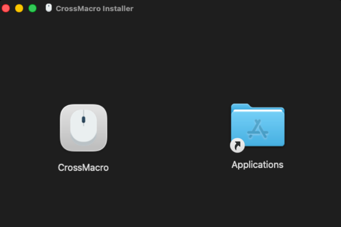
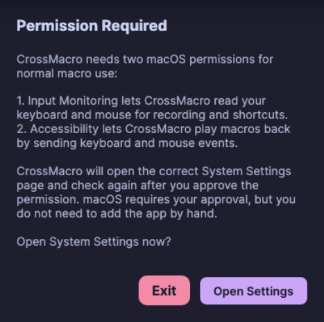
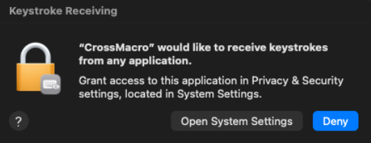
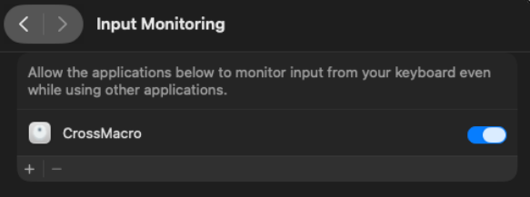
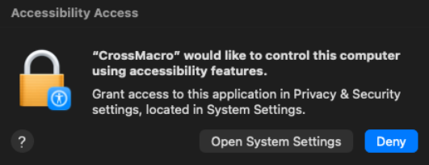
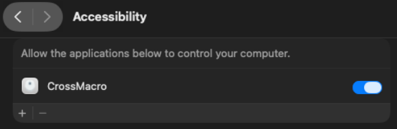

# macOS Setup

CrossMacro on macOS needs the normal drag-and-drop app install flow plus macOS
privacy permissions for desktop automation. Use this page when setting up the
DMG build from GitHub Releases.

## Install

1. Download the matching `.dmg` from
   [GitHub Releases](https://github.com/alper-han/CrossMacro/releases):
   `osx-arm64` for Apple Silicon or `osx-x64` for Intel.
2. Open the DMG.
3. Drag **CrossMacro** to **Applications**.
4. Launch CrossMacro from **Applications**.



## If macOS says the app is damaged

GitHub DMG downloads can sometimes keep a quarantine flag that makes macOS show
this warning:


If this happens after dragging the app to Applications, run:

```bash
xattr -cr /Applications/CrossMacro.app
```

Then open CrossMacro again from **Applications**.

## Required permissions

CrossMacro needs two macOS privacy permissions for normal macro use:

- **Input Monitoring** lets CrossMacro read keyboard and mouse input for
  recording and global shortcuts.
- **Accessibility** lets CrossMacro play macros back by sending keyboard and
  mouse events.

CrossMacro opens the relevant System Settings page when possible and asks macOS
to add the current app to the permission list. In most cases, you only need to
turn on the CrossMacro toggle and return to the app.



## Input Monitoring

When macOS asks for keystroke access, choose **Open System Settings**.



In **System Settings > Privacy & Security > Input Monitoring**, enable
**CrossMacro**. CrossMacro opens this page and gets the app listed when macOS
allows it, so the remaining step is usually just turning the toggle on.



Input Monitoring covers recording, global shortcuts, and reading input. It does
not by itself allow playback.

## Accessibility

After Input Monitoring is approved, CrossMacro may ask for Accessibility before
playback can work. Choose **Open System Settings** when macOS shows the
Accessibility prompt.



In **System Settings > Privacy & Security > Accessibility**, enable
**CrossMacro**.



Accessibility covers playback and input injection. If a permission is visible as
enabled but CrossMacro still reports it missing, quit and reopen CrossMacro.

## Troubleshooting

Start with doctor when setup, recording, shortcuts, or playback do not work:

```bash
/Applications/CrossMacro.app/Contents/MacOS/CrossMacro.UI doctor --json --verbose
```

DMG installs do not usually add a `crossmacro` command to your shell `PATH`. If
you have installed a shell alias or symlink yourself, `crossmacro doctor --json
--verbose` is equivalent.

For bug reports, include your macOS version, CrossMacro version, install method,
relevant logs, and doctor output.
