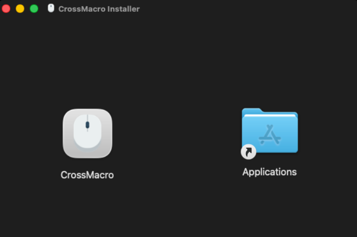
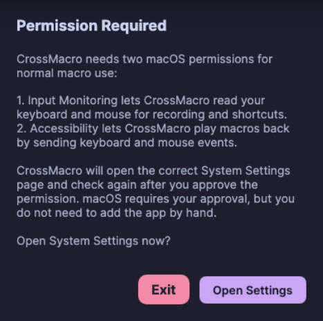
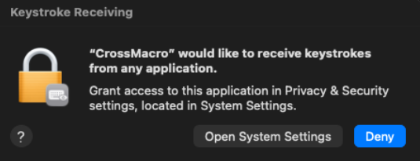
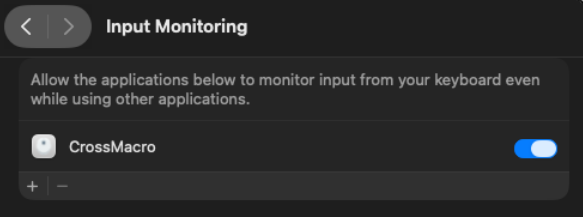
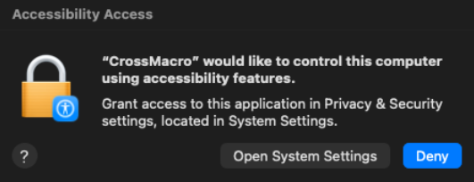
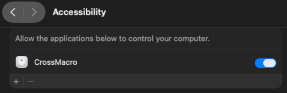

# macOS Setup

<a id="install"></a>
<a id="if-macos-says-the-app-is-damaged"></a>
<a id="required-permissions"></a>

CrossMacro supports macOS 14 or newer. Installing the DMG uses the normal
drag-and-drop flow. For normal macro use, CrossMacro asks you to approve two
macOS privacy permissions; Screen Recording is needed only for visual workflows.

| What you want to do | Permission |
| --- | --- |
| Record input or use global shortcuts | Input Monitoring |
| Play mouse and keyboard actions | Accessibility approval flow |
| Read pixels or find images | Screen Recording |

If a permission is already enabled but CrossMacro cannot see it, quit the app
completely and open it again.

## Install The App

1. Download the matching `.dmg` from
   [GitHub Releases](https://github.com/alper-han/CrossMacro/releases):
   `osx-arm64` for Apple Silicon or `osx-x64` for Intel.
2. Open the DMG.
3. Drag **CrossMacro** to **Applications**.
4. Launch CrossMacro from **Applications**.



## Gatekeeper Warning

GitHub DMGs are currently unsigned and not notarized because the project does not
use an Apple Developer account. A first-launch Gatekeeper warning is therefore
expected on some macOS versions:


Follow the
[Gatekeeper guide](troubleshooting/macos-gatekeeper.md) for **Open Anyway**, the
targeted quarantine command, and optional checksum or signature inspection.

## Grant Permissions

CrossMacro needs two privacy permissions for normal record-and-playback use:

- **Input Monitoring** lets CrossMacro read keyboard and mouse input for
  recording and global shortcuts.
- **Accessibility** is the macOS approval flow CrossMacro uses for playback and
  input injection.

Macros that react to pixels, colors, screenshots, or images also need **Screen
Recording**. Image format and matching details belong to the
[CLI reference](cli.md#screen-command).

CrossMacro opens the relevant System Settings page when possible and asks macOS
to add the current app to the permission list. In most cases, you only need to
turn on the CrossMacro toggle and return to the app.



## Input Monitoring

When macOS asks for keystroke access, choose **Open System Settings**.



In **System Settings > Privacy & Security > Input Monitoring**, enable
**CrossMacro**. CrossMacro opens this page and gets the app listed when macOS
allows it, so the remaining step is usually just turning the toggle on.



Input Monitoring covers recording, global shortcuts, and reading input. It does
not by itself allow playback.

## Accessibility

After Input Monitoring is approved, CrossMacro may ask for Accessibility before
playback can work. Choose **Open System Settings** when macOS shows the
Accessibility prompt.



In **System Settings > Privacy & Security > Accessibility**, enable
**CrossMacro**.



Accessibility covers the normal playback and input-injection flow. If a
permission is visible as enabled but CrossMacro still reports it missing, quit
and reopen CrossMacro.

## Screen Recording

Screen reading commands need macOS Screen Recording permission before CrossMacro
can sample pixels from the desktop. In **System Settings > Privacy & Security >
Screen & System Audio Recording** (or **Screen Recording** on older macOS
versions), enable **CrossMacro**.

If you grant Screen Recording while CrossMacro is running, quit and reopen the
app before testing `pixelcolor`, `waitcolor`, `pixelsearch`, or image commands
again.

## Troubleshooting

Start with doctor when setup, recording, shortcuts, or playback do not work:

```bash
/Applications/CrossMacro.app/Contents/MacOS/CrossMacro.UI doctor --json --verbose
```

DMG installs do not usually add a `crossmacro` command to your shell `PATH`. If
you have installed a shell alias or symlink yourself, `crossmacro doctor --json
--verbose` is equivalent.

For bug reports, include your macOS version, CrossMacro version, install method,
relevant logs, and doctor output.

If the app does not open, use the [Gatekeeper guide](troubleshooting/macos-gatekeeper.md).
If permissions remain unavailable after reopening the app, use the
[macOS permission troubleshooting guide](troubleshooting/macos-permissions.md).
